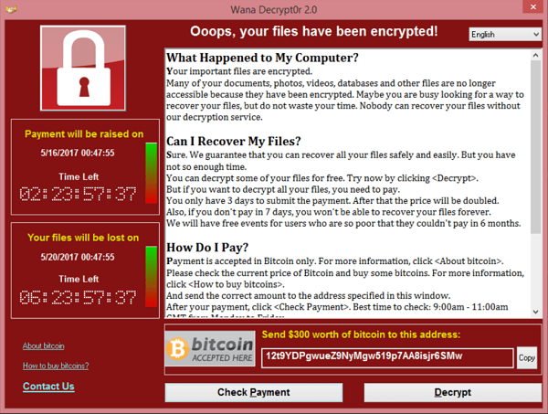

## Studii de caz: sisteme

In continuare vom prezenta exemple reale de  **vectori de atac** folositi impotriva sistemelor informatice.

### Stuxnet

Malware de tip **worm**.
A fost facut initial pentru a ataca o anumita tinta.
Tinta erau systemele care controla anumite turbine ale unei centrale nucleare.
Dintr-o eroare umana intr-dusa in urma unui update, s-a raspandit la un laptop al unui angajat, dupa care in intreaga lume.

Elemente principale:

- Raspandirea initiala se bazeaza pe dispozitive USB
  - stick infectat folosit gresit
- Exploituri pentru Windows
  - S-au inlantuit mai multe exploituri de tip **zero-day** (vulnerabilitati care nu au mai fost pana in acel punct folosite public, sau nu se cunosc folosiri ale ei)
  - Se estimeaza ca au fost folosite patru exploituri de tip zero-day
  - Virusul s-a raspandit pe aceasta cale (dispozitive de tip Windows)
  - Pe fiecare dispozitiv infectat erau instalate **rootkit-uri** (software malitios care permite conectarea de la distanta pe un dispozitiv infectat)
- Exploit pentru un driver SCADA instalat pe statii Windows
  - Driverul era produs de Siemens
  - Driverul facilita comunicatia dintre Windows si dispozitive tip PLC de la Siemens
  - Virusul putea apoi altera codul de pe PLC
- Virusul controleaza apoi viteza de rotatie a unui motor

### WannaCry

Malware de tip Cryptoworm.
In esenta se propaga ca un Vierme, si cripteaza date de pe tinta.
Apoi cere detinatorului dispozitivului bani pentru a primi cheia de decryptare.

Elemente principale:

- Exploit-ul **EternalBlue** faciliteaza propagarea virusului
  - Exploateaza protocolul SMB
  - Un grup numit **The Shadow Brokers** fura de la **National Security Agency** exploitul numit **EternalBlue** si il publica pe Internet
  - O luna mai tarziu apare **WannaCry** si afecteaza sistemele care la acel moment nu aplicasera deja patch-urile pe care **Microsoft** le-a publicat intre timp
- Utilitarul **DoublePulsar** este un **rootkit** care se instala automat pe dispozitivele compromise
- Toate datele de pe dispozitiv erau apoi criptate si se cereau bani in Bitcoin pentru ca datele sa fie decryptate
